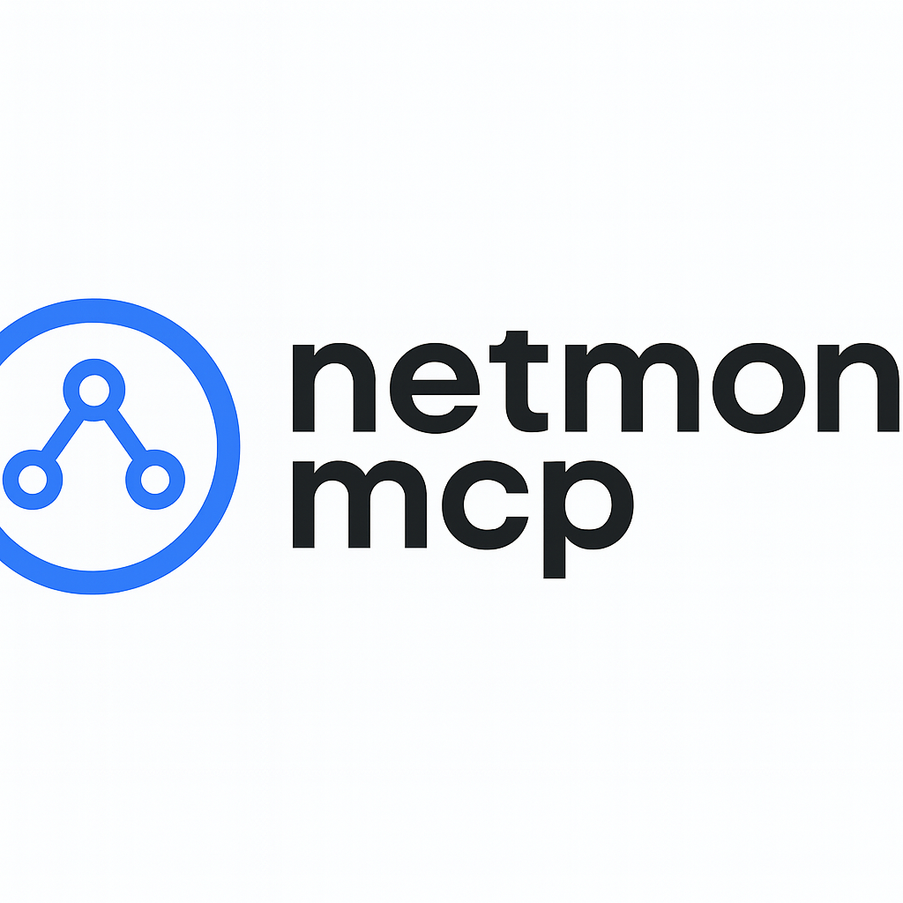

A proof-of-concept to demonstrate the combinination of the 
ergonomic UI of AI agents with the power of the Linux kernel! 

The **netmon-mcp** tool uses [ebpf](https://ebpf.io/) to interface with 
kernel data structures and pipelines that data to the MCP server for parsing. 
The AI model can then analyze the data and present it in a report to the user.

## Features
The operations currently supported by **netmon-mcp** are `incoming` and `ougoing`.

- `incoming`    returns the number of igress packets per second (measured in the span of 5 seconds).
- `ougoing`     waits until a new TCP connection is established and returns the connection details (IPv4, ports, etc.).


> Example via opencode.

## Requirements

### Operating System
- [x] Kernel with eBPF + XDP support  
- [x] `clang` and `llc` (LLVM) for building eBPF code  
- [x] `sudo` privileges (required to load eBPF programs and running Opencode)

### Go Requirements
- Go 1.22+
- Cilium/ebpf library
- [bpf2go](https://pkg.go.dev/github.com/cilium/ebpf/cmd/bpf2go)

Install dependencies:

```bash
sudo apt update
sudo apt install clang llvm

# NB: You may need to install additional Linux and ebpf headers.
```

To regenerate the BPF bindings:

```bash
go generate ./...
```

You may optionally set the environment variables:
```bash
cp env.example .env
# Fill out .env
. ./.env
```

## Running the MCP Server

### 1. Build
```bash
go build
```

### 2. Run (Linux only)
Because XDP requires privileged access:

```bash
sudo ./netmon-mcp
```

## Project Structure

```
netmon-mcp/
│
├── main.go                   # MCP server entry point
├── go.mod / go.sum           # Go dependencies
│
├── ebpf/
    ├── netmon.c              # eBPF XDP program
    ├── netmon_bpfel.go       # Auto-generated BPF bindings
    ├── netmon_bpfel.o        # Compiled ELF object
    ├── netmon.go       # Go wrapper for eBPF loading & traffic monitoring
    ├── include
        ├── bpf_endian.h      # Libraries to simplify structs
        ├── bpf_helper_defs.h
        ├── bpf_helpers.h
        ├── bpf_tracing.h
        ├── common.h
        └── LICENSE.BSD-2-Clause
```

## How the Project Works (Current State)

### 1. MCP Server
The server initializes using:

```go
server.NewMCPServer(...)
server.ServeStdio(s)
```

This means it uses **stdio transport**, which Claude Desktop supports.

### 2. Exposed Tool: `network-monitor`

Registered with:

```go
mcp.NewTool("network-monitor", ...)
```

### 3. eBPF Logic
When the `incoming` operation is executed:

1. The Go program loads the auto-generated eBPF objects
2. XDP program attaches to the network interface
3. For 5 seconds, packet counts are read from the BPF map
4. The average packets/second is returned

This is done in:

```go
ebpf.IncomingPacketsPerSecond()
```  
  
When the `outgoing` operation is executed:

1. The Go program loads the auto-generated eBPF objects
2. Tracing program attaches to the network network stack
3. Go program waits for a new TCP connection to be established

This is done in:

```go
ebpf.MonitorTcpConnections()
```

### Common Pitfalls
If MEMLOCK ulimit is too low, fix:

```bash
sudo sysctl -w kernel.unprivileged_bpf_disabled=0
ulimit -l unlimited
```

Or add to `/etc/security/limits.conf`:

```
* hard memlock unlimited
* soft memlock unlimited
```

## Claude MCP Client Usage

Example config:

```json
{
  "mcpServers": {
    "netmon": {
      "command": "wsl.exe",
      "args": [
        "bash",
        "-lc",
        "cd /home/youruser/netmon-mcp && ./netmon-mcp"
      ]
    }
  }
}
```

Opencode automatically connects via **stdio** (you can find an example configuration in _opencode.jsonc_).

## Future Work

- [ ] Replace stdio + sudo with:
    - [ ] MCP gateway (non-root)
    - [ ] Privileged daemon (root)
- [ ] Add HTTP transport
- [ ] Add outgoing traffic monitoring
- [ ] Interface auto-detection
- [ ] Docker support
- [ ] Remote monitoring via SSH or HTTP tunnel

## License

MIT License
